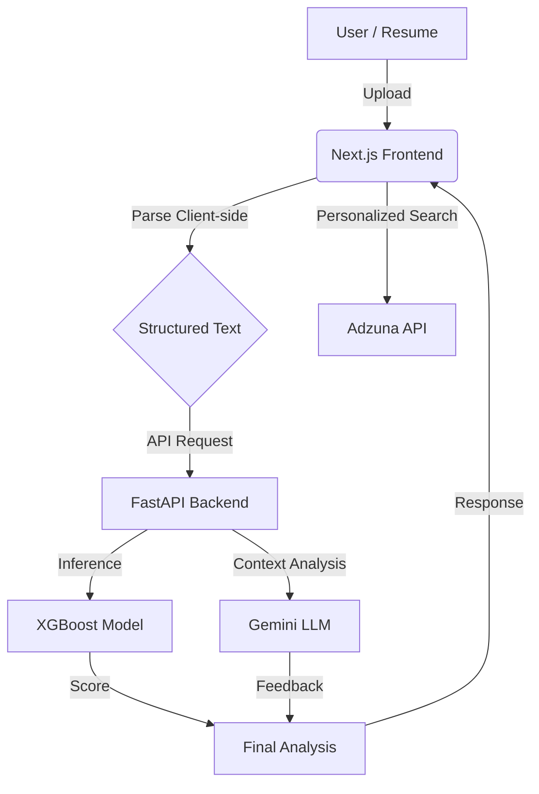

# Next-hire

<p align="center">
  
</p>

<p align="center">
  <strong>An AI-powered career strategist that bridges the gap between your resume and your dream job using hybrid ML scoring.</strong>
</p>

<p align="center">
  <a href="https://github.com/divyanshu02raj/Next-hire">
    
  </a>
  <a href="https://github.com/divyanshu02raj/Next-hire/stargazers">
    
  </a>
  <a href="https://next-hire-lilac.vercel.app">
    
  </a>
</p>

<p align="center">
  
  
  
  
  
  
</p>

## 🎬 Demo / Live Preview

Experience **Next-hire** in action:

- **Live Demo:** [next-hire-lilac.vercel.app](https://next-hire-lilac.vercel.app)
- **Video Demo:** [Watch the Walkthrough]
- **Source Code:** [GitHub Repository](https://github.com/divyanshu02raj/Next-hire)

## 📑 Table of Contents
1. [Overview](#1-overview)
2. [Key Features](#2-key-features)
3. [Tech Stack](#3-tech-stack)
4. [Screenshots](#4-screenshots)
5. [The Hybrid Engine](#5-the-hybrid-engine)
6. [The LLM Prompt](#6-the-llm-prompt)
7. [Architecture](#7-architecture)
8. [Architecture Diagram](#8-architecture-diagram)
9. [Folder Structure](#9-folder-structure)
10. [How to Run Locally](#10-how-to-run-locally)
11. [Future Enhancements](#11-future-enhancements)
12. [Contributing](#12-contributing)
13. [Contributors](#13-contributors)

---

## 1. Overview

**Next-hire** is a sophisticated, AI-driven career optimization platform. Unlike basic keyword parsers, Next-hire uses a **hybrid intelligence approach**: a custom-trained **XGBoost machine learning model** provides objective, data-driven matching scores, while the **Google Gemini API** delivers nuanced, human-like qualitative analysis and actionable resume improvements.

The system is designed for the modern job seeker, providing a seamless flow from resume upload to live job discovery, all within a high-performance, responsive dashboard.

## 2. Key Features

1. **Hybrid ATS Scoring**
   Combines traditional ML (XGBoost + TF-IDF) with advanced LLM reasoning to ensure scores are both statistically accurate and contextually relevant.
   
2. **Client-Side Document Parsing**
   Resumes (PDF & DOCX) are parsed directly in the browser using `pdfjs-dist` and `mammoth`, ensuring privacy and lightning-fast processing without server bottlenecks.

3. **Actionable Resume Rewrites**
   AI doesn't just score you—it helps you improve. Receive exact bullet-point suggestions using the **STAR method** to boost your impact.

4. **Personalized Job Discovery**
   Integrates with the **Adzuna API** to fetch real-time job listings that match your extracted skills and preferred roles.

5. **Interactive Analysis Dashboard**
   A professional UI that breaks down your "Match Score", highlights "Missing Keywords", and provides a "Career Level" fit assessment.

6. **Modern UI/UX**
   Built with **Tailwind CSS 4** and **Lucide React**, offering a premium dark-mode experience with smooth transitions and responsive layouts.

## 3. Tech Stack

| **Category** | **Technology** |
| :--- | :--- |
| **Frontend** | Next.js 15, React 19, Zustand, Tailwind 4, Lucide React |
| **Backend** | FastAPI, Pydantic, Scikit-learn, XGBoost |
| **Parsing** | pdfjs-dist, Mammoth.js (Client-side) |
| **AI/ML** | Google Gemini (Flash-latest), TF-IDF Vectorization |
| **Data Flow** | REST API, JSON Schema Validation |

## 4. Screenshots

### 🖼️ Landing Page
The entry point of Next-hire, featuring our premium dark-mode aesthetic and the core value proposition.


---

### 📄 Resume Details & Smart Parsing
Clean, structured visualization of extracted data, including skills, experience, and certifications.


---

### 📊 ATS Analysis Dashboard (by Career Level)
Nuanced feedback on your fit for specific roles based on career level grounding.


---

### 📊 ATS Analysis Dashboard (by Job Description)
Analysis grounded by specific job descriptions provided by the user.


---

### 🔍 Personalized Jobs Tab
Discover roles that fit your profile with our integrated job search and interactive swipe interface.


## 5. The Hybrid Engine

Next-hire operates on a two-stage evaluation pipeline:

- **Stage 1: Objective Matching (XGBoost)**
  - Vectorizes Resume and Job Description using TF-IDF.
  - Computes cosine similarity and custom heuristic features (keyword density, experience gap).
  - Predicts a raw score (0-100) using a pre-trained XGBoost regressor.

- **Stage 2: Qualitative Analysis (Gemini LLM)**
  - Uses the XGBoost score as a "grounding" point.
  - Analyzes the textual context to generate justification, strengths, and weaknesses.
  - Provides semantic rewrite suggestions for resume bullet points.

## 6. The LLM Prompt

Next-hire uses a meticulously engineered prompt to ensure constant, high-quality feedback:

```markdown
**Persona:** You are an AI Career Strategist Platform.
**Task:**
Analyze a resume against a target match score of {score}%.
1. **summary:** Justify why the candidate received this specific score.
2. **strengths:** Identify 3-5 key technical or impact strengths.
3. **areas_for_improvement:** Provide actionable advice for the remaining gap.
4. **rewrite_suggestions:** 
   - Identify weak bullet points.
   - Generate "STAR" method improvements.
   - Ensure original vs. suggested parity.
```

## 7. Architecture

Next-hire is built for performance and scalability:
- **FastAPI Backend**: Uses an asynchronous lifespan manager to load ML models into memory once at startup, ensuring <50ms inference latency.
- **Next.js Frontend**: Leverages the App Router for efficient server/client component separation and optimized asset loading.
- **Zustand State**: A lightweight store manages the shared state between the resume upload, analytics dashboard, and job search tabs.

## 8. Architecture Diagram



## 9. Folder Structure

```text
Next-hire/
├── backend/            # FastAPI API & ML Inference
│   ├── app/            # Pydantic models & logic
│   ├── main.py         # Entry point & Endpoints
│   └── *.joblib        # Pre-trained ML artifacts
├── frontend/           # Next.js Application
│   ├── src/app/        # App Router pages & components
│   └── public/         # Global assets
└── ml_model/           # Training & Engineering Pipeline
    ├── scripts/        # Data generation & training
    └── datasets/       # Training CSVs
```

## 10. How to Run Locally

### 1️⃣ Clone and Prepare
```bash
git clone https://github.com/divyanshu02raj/Next-hire.git
cd Next-hire
```

### 2️⃣ Backend Integration
```bash
cd backend
pip install -r requirements.txt
```

Create a `backend/.env` file:
```env
CORS_ORIGINS=http://localhost:3000
GOOGLE_API_KEY=your_gemini_key
ADZUNA_APP_ID=your_adzuna_app_id
ADZUNA_APP_KEY=your_adzuna_app_key
ADZUNA_COUNTRY=in
```

> [!IMPORTANT]
> Ensure there are **no spaces** around the `=` sign in your `.env` file (e.g., `KEY=VALUE`, not `KEY = VALUE`).

Start the API:
```bash
uvicorn main:app --reload
```

### 3️⃣ Frontend Integration
```bash
cd frontend
npm install
# Create .env.local with NEXT_PUBLIC_API_URL=http://localhost:8000
npm run dev
```

## 11. Future Enhancements

- **🔹 Multi-Resume A/B Testing**: Compare different versions of your resume against the same JD.
- **🔹 Interview Coaching**: AI-generated interview questions based on your resume's weaknesses.
- **🔹 One-Click Apply**: Chrome extension to autofill applications using your parsed Next-hire data.

## 12. Contributing

1. Fork the Project.
2. Create your Feature Branch (`git checkout -b feature/AmazingFeature`).
3. Commit your Changes (`git commit -m 'Add some AmazingFeature'`).
4. Push to the Branch (`git push origin feature/AmazingFeature`).
5. Open a Pull Request.

## 13. Contributors

Made with ❤️ by:

- **Divyanshu Raj** ([@divyanshu02raj](https://github.com/divyanshu02raj)) | [LinkedIn](https://www.linkedin.com/in/div02raj) | [Email](mailto:divyanshuraj2206@gmail.com)
- **Harsh Singh Parihar** ([@ALaiNPLayZ](https://github.com/ALaiNPLayZ)) | [LinkedIn](https://linkedin.com/in/harsh-parihar-908944251) | [Email](mailto:harshsinghparihar9467@gmail.com)
- **Nikhil Dhanda** ([@nikhildhanda04](https://github.com/nikhildhanda04)) | [LinkedIn](https://linkedin.com/in/nikkhildhanda) | [Email](mailto:nikhildhanda84@gmail.com)
- **Aditi Sinharoy** ([@aditi030105](https://github.com/aditi030105)) | [LinkedIn](https://linkedin.com/in/aditi-sinharoy) | [Email](mailto:aditisinharoy0301@gmail.com)
- **Aman Yadav** ([@Amanydv16](https://github.com/Amanydv16)) | [LinkedIn](https://linkedin.com/in/aman-yadav-ba1388250) | [Email](mailto:amanyadavji9099@gmail.com)
- **Vaibhav Parekh** ([@VaibhavParekh27034](https://github.com/VaibhavParekh27034)) | [LinkedIn](https://www.linkedin.com/in/vaibhav-parekh-86255a251) | [Email](mailto:vaibhavparekh0704@gmail.com)

---
*Next-hire: Accelerating your career with Hybrid Intelligence.*
